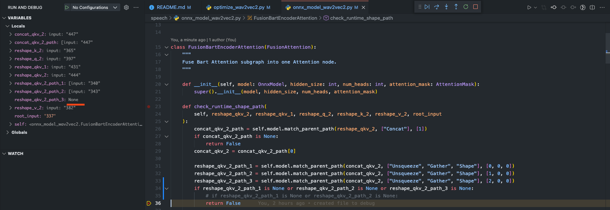
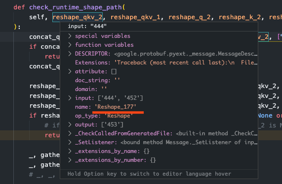
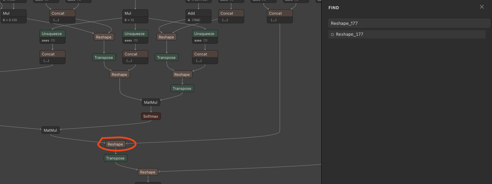
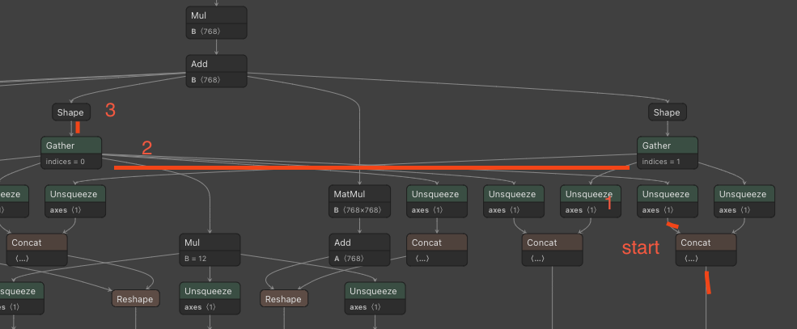

# Experiments and examples converting Transformers to ONNX

This repository containes experiments and examples on converting different Transformers to ONNX. 

## Inspect a graph with [Netron](https://github.com/lutzroeder/Netron)

```bash
netron exports/model.onnx
```

netron speech/exports/wav2vec2.onnx


a asdas
 ## References & Resources

* [Transformers documentation](https://huggingface.co/docs/transformers/serialization)
* [Keras/TF to onnx](https://github.com/onnx/tensorflow-onnx)
* [`torch.onnx` export documentation](https://pytorch.org/docs/stable/onnx.html)
* [ONNX Opset documentation with operators](https://github.com/onnx/onnx/blob/master/docs/Operators.md)
* [export T5 from `fastT5`](https://github.com/Ki6an/fastT5/blob/8dda859086af631a10ad210a5f1afdec64d49616/fastT5/onnx_exporter.py#L45)
* [mrpc example notebook](https://github.com/philschmid/transformers-inference-experiments/blob/main/onnx/simple_mrpc_example.ipynb)
* [Tensorflow Bert example noteboob](https://github.com/onnx/tensorflow-onnx/blob/master/tutorials/huggingface-bert.ipynb)
* [Tensorflow2onnx transformers tests](https://github.com/onnx/tensorflow-onnx/blob/master/tests/huggingface.py)
* [Sample Input Tensorflow](https://github.com/onnx/tensorflow-onnx/blob/72d64606d9aff4f93bb064ba901af49377266150/tests/huggingface.py#L129)
* [Converting Seq2Seq model BART](https://github.com/huggingface/transformers/tree/master/examples/research_projects/onnx/summarization)

# How to optimize the model architecture which isn't yet support in [MODEL_TYPES](https://github.com/microsoft/onnxruntime/blob/001cc539683d5e294d7b306d57e5d5bbb8422d73/onnxruntime/python/tools/transformers/optimizer.py#L36) provided by Microsoft and ONNX

**Requirements:**
* converted `*.onnx` file

Best way to optimize new model architectures, e.g. `wav2vec` is to first look at the architecture and which attention mechanisms are used. In This example wav2vec2 is a copy of the [BartAttention](https://github.com/huggingface/transformers/blob/f00f22a3e290fd377b979124dcf9800b3d73eb11/src/transformers/models/wav2vec2/modeling_wav2vec2.py#L513). 

The first test would be to optimize the model with [BartOnnxModel](https://github.com/microsoft/onnxruntime/blob/master/onnxruntime/python/tools/transformers/onnx_model_bart.py) or `model_type` = `bart`, but sadly this did work. 

To understand what we need to change/ what we need to adjust we can copy/fork the closesd "model" in this case the [BartOnnxModel](https://github.com/microsoft/onnxruntime/blob/master/onnxruntime/python/tools/transformers/onnx_model_bart.py) and debug it.

## Debugging/creating a custom supported architecture. 

**Step 1:** copy the model file and rename to your architecture. In our example this would mean copy [onnx_model_bart.py](https://github.com/microsoft/onnxruntime/blob/master/onnxruntime/python/tools/transformers/onnx_model_bart.py) and name it `onnx_model_wav2vec2.py`. 

**Step 2:** start netron with the converted model to be able to inspect and search through the graph.

**Step 3:** add a break points to every `return False` in our `onnx_model_wav2vec2.py`. Since if the method `check_runtime_shape_path` returns `False` the Attenion layer cannot be fused. 

**Step 4:** Run Python debugger to see where it breaks and then debug. In our example we can use `optimize_wav2vec2.py`, which tries to optimizes the model. You can find a step-by-step example for it in [Debug Optimization & Graph](#debug-optimization--graph).

**Step 5:** Use it!


## Debug Optimization & Graph

Starting the Pythong script with the Debugger and break points at every `return False` should break at the following node:


The reason for this is `reshape_qkv_2_path_3` is None, which means we need to find out why it is None and not a list of inputs of the matching path. But before that a quick explanation what `check_runtime_shape_path` does. It basically runs through the model graph to check & find path which can be fused. In our breaking example we are at `Reshape_177`.



We can now search for that in netron. Therefore use the search `cmd+f` and type `Reshape_177`.



Next step of `check_runtime_shape_path` is to find to `concat_qkv_2_path = self.model.match_parent_path(reshape_qkv_2, ["Concat"], [1])` in our case it is `Concat_176`. Going further we see that `reshape_qkv_2_path_3` is none, which is the reason why return `False`. So lets inspect the graph and find out why. 

The [match_parent_path](https://github.com/microsoft/onnxruntime/blob/001cc539683d5e294d7b306d57e5d5bbb8422d73/onnxruntime/python/tools/transformers/onnx_model.py#L310) method needs to be read backwards. For `reshape_qkv_2_path_1 = self.model.match_parent_path(concat_qkv_2, ["Unsqueeze", "Gather", "Shape"], [0, 0, 0])` This means around parent node is `concat_qkv_2` or `Concat_176` and then we go up the graph backwards so next node is `Shape` followed, by `Gather` and then `Unsqueeze`.



Comparing `reshape_qkv_2_path_1`, which is `[340,338,337]` or `Unsqueeze_173`, `Gather_118` & `Shape_116` and `reshape_qkv_2_path_2`, which is `[343,341,337]` or `Unsqueeze_175`, `Gather_121` & `Shape_119` we notice there is no third path to find and match for `reshape_qkv_2_path_3`. Meaning this check is obsolete and can be removed. 

After we have done this and adjusted the if followed we can re-run our python script with our break points to find the next issue. Luckly this was to only one. 

After everything is done we can inspect the graph again and can see all of the operations has been fused into `Attention` operators. 